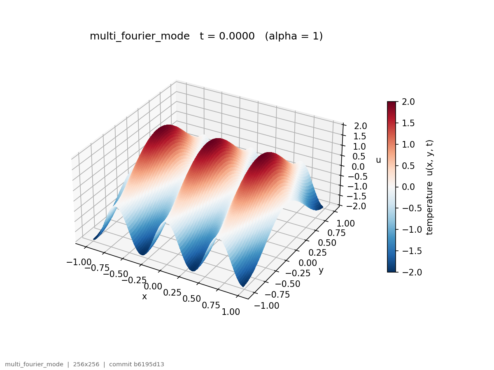
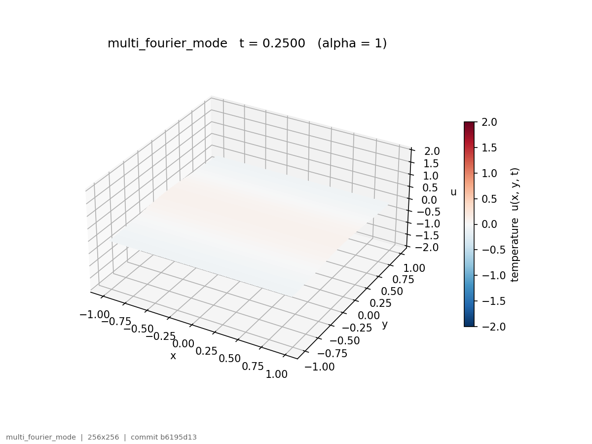
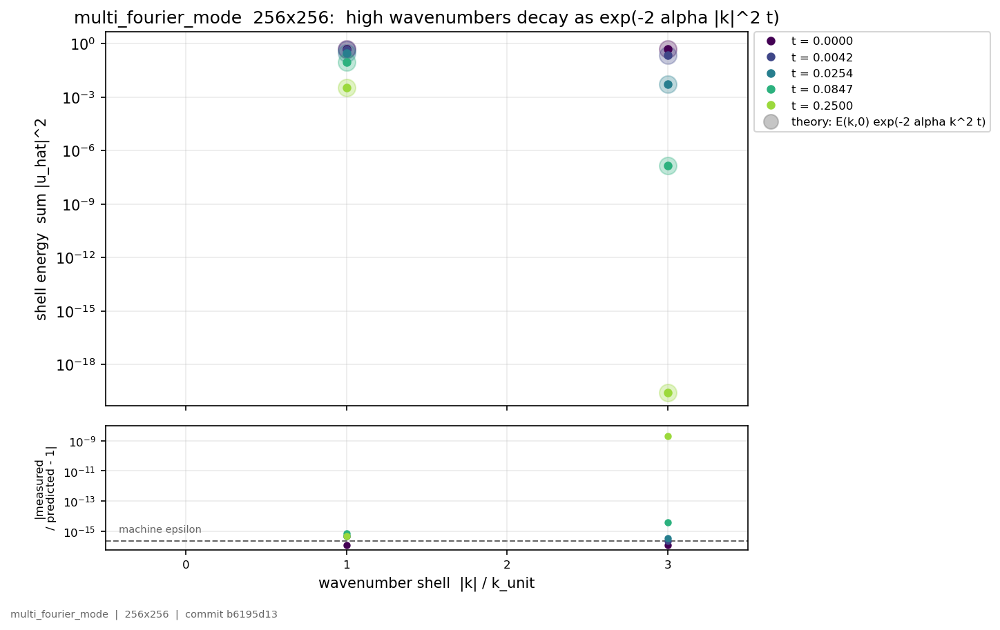
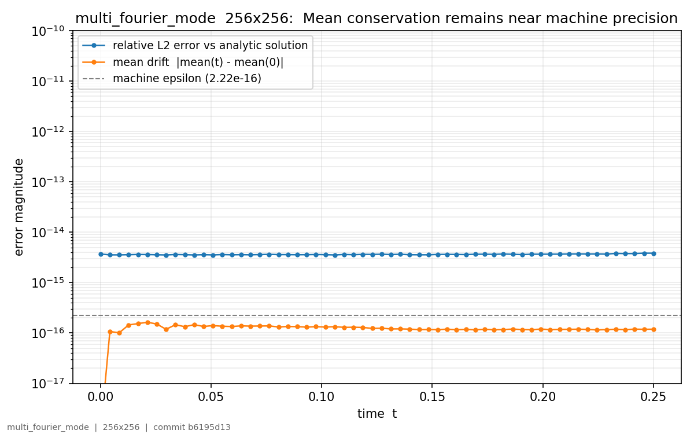
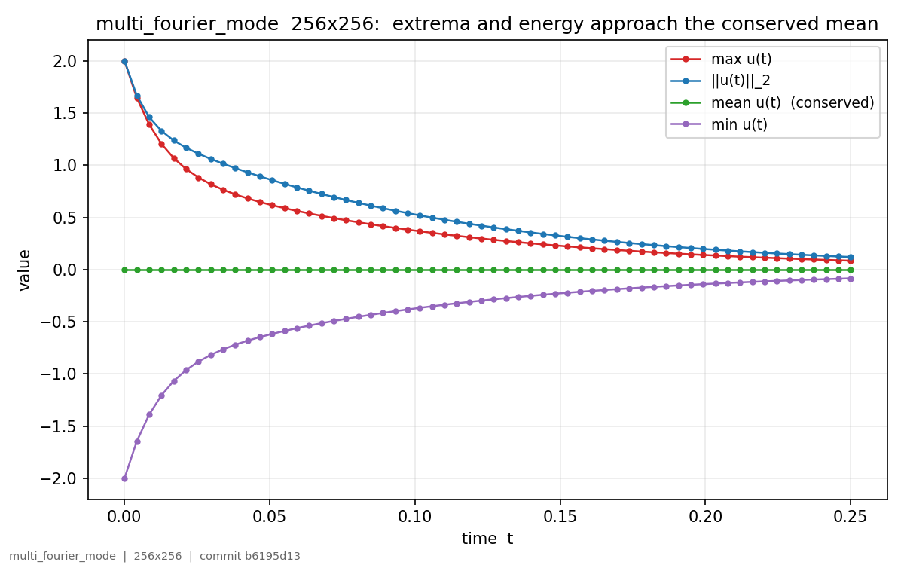
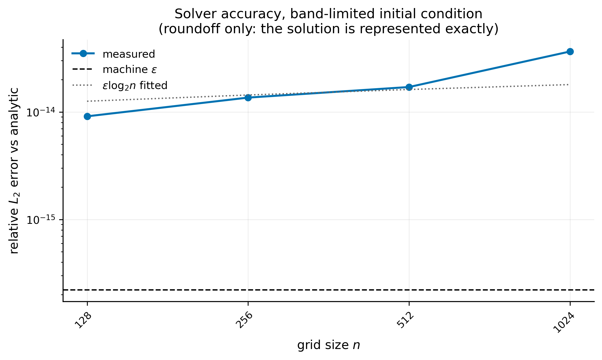
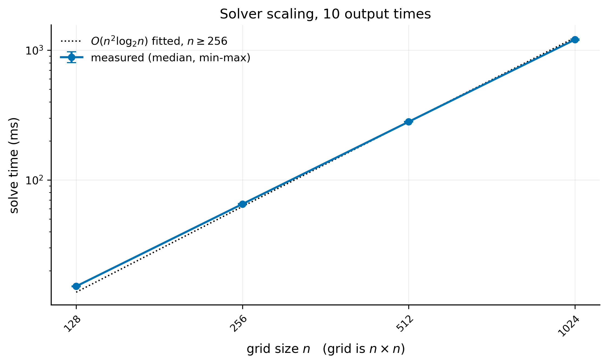
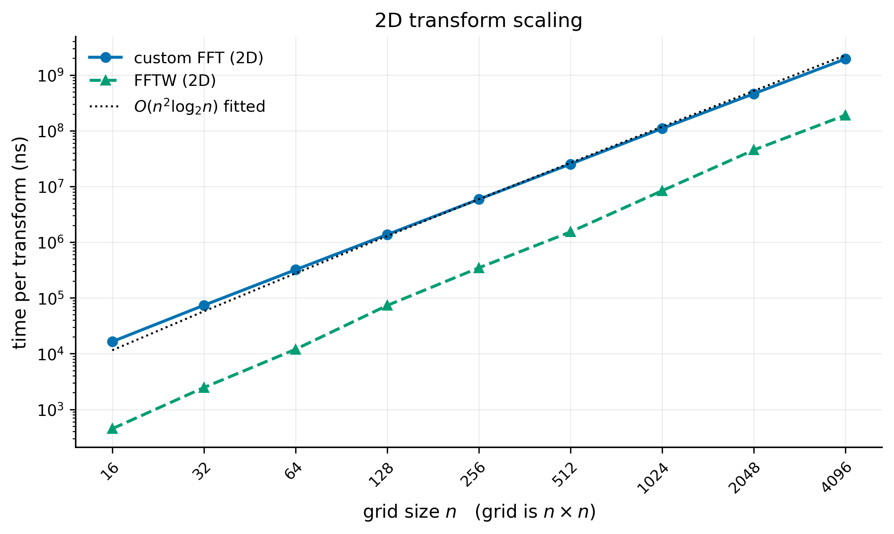
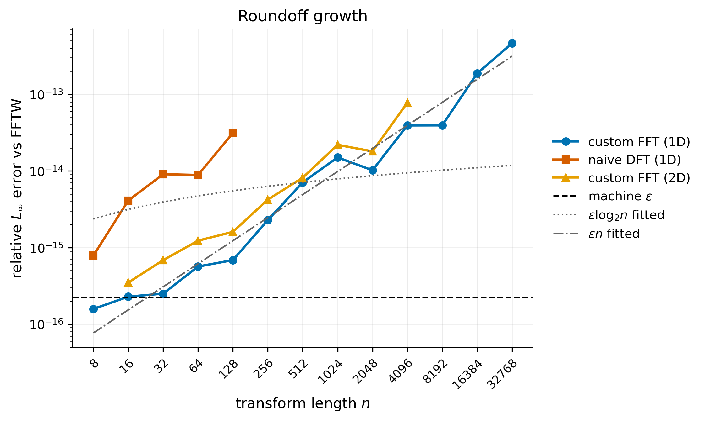

# 2D Heat Equation — Fourier Spectral Solver in C++17

A from-scratch spectral solver for the 2D heat equation on a periodic domain. The field is
transformed to frequency space, where each Fourier mode decays by an exact analytic factor, and
transformed back. Everything below the solver is implemented here: the 1D and 2D DFT, a radix-2
FFT, and the wavenumber construction that connects them to the physics. FFTW is linked as an
external reference for correctness and performance comparison, not as a dependency of the
numerics.

Because the decay factor is exact rather than a discretisation of the time derivative, there is
no timestep and no stability restriction. A snapshot at any time is computed directly from the
initial condition in a single forward transform, one multiplication per mode, and one inverse
transform.

Runs are driven by JSON configuration files and write a single self-describing HDF5 file
containing the field snapshots, coordinate grids, per-snapshot diagnostics, the verbatim input
configuration, and build provenance. A Python suite turns that file into plots and animations.

**Verification.** The transforms are checked against mathematical identities that must hold
exactly — Parseval, linearity, conjugate symmetry, time shift, modulation, separability, and
round-trip — and cross-validated against FFTW on 1D transforms to n = 32768 and 2D grids to
4096×4096, with a size-dependent tolerance ladder. The solver is checked for spectral
convergence, mean conservation, and energy behaviour, and against the analytic solution for
Fourier-mode initial conditions where one exists.

**Benchmarks.** Custom FFT against a direct DFT and against FFTW, 2D scaling, solver throughput
with and without HDF5 I/O, a phase breakdown from an in-solver timing registry, and modelled
versus measured memory. Methodology is documented in full rather than implied.

---

## Contents

- [Results](#results)
- [Design choices](#design-choices)
- [Dependencies](#dependencies)
- [Installation](#installation)
- [Build](#build)
- [Running the solver](#running-the-solver)
- [Configuration reference](#configuration-reference)
- [Output format](#output-format)
- [Figures and animations](#figures-and-animations)
- [Tests](#tests)
- [Benchmarks](#benchmarks)
- [Measurement conditions](#measurement-conditions)
- [Troubleshooting](#troubleshooting)
- [Limitations](#limitations)
- [Future work](#future-work)
- [Documentation in progress](#documentation-in-progress)
- [Issues and feedback](#issues-and-feedback)
- [Contributors](#contributors)
- [License](#license)

---

## Results

Every figure below is committed in this repository and was produced by the run configured in
[`configs/multi_mode_demo.json`](configs/multi_mode_demo.json) or by the benchmark suite. Each
carries the grid size and the git commit that produced it in its footer.

### The solver in one run

The showcase run superposes two Fourier modes on a 256×256 periodic grid: one varying three times
across the domain in x, the other once in y.

| t = 0 | t = 0.25 |
| --- | --- |
|  |  |

The three ridges flatten while the coarse variation underneath them survives. That is the whole
mechanism of the heat equation in one picture: diffusion is wavenumber-selective damping, and
fine structure is destroyed before coarse structure. The two modes here differ by a factor of
three in wavenumber, so by a factor of nine in the decay exponent — the ridges die roughly nine
times faster than the field they sit on.

The animation shows it happening:
[`surface_animation.gif`](output/figures/multi_fourier_mode/heat_multi_mode/surface_animation.gif).

### The same effect, measured



The two occupied wavenumber shells are plotted against the theoretical decay
`E(k, 0) · exp(-2α|k|²t)`, drawn as the pale halo behind each measured point. Over the run, shell
1 loses about two orders of magnitude while shell 3 loses twenty. The lower panel makes the
agreement quantitative: measured and predicted match to machine precision in the shells carrying
real energy, and the deviation grows only where a shell has decayed to ~1e-19 and there is
nothing left to resolve.

This is a mode-by-mode verification of the decay law, finer grained than any aggregate error
norm.

### Accuracy and conservation over the run



Relative L² error against the analytic solution holds flat at ~3.6e-15 for the entire run rather
than accumulating with time — a consequence of the exact modal decay, which computes each snapshot
directly from the initial condition instead of stepping to it. Mean drift stays below one machine
epsilon, confirming that the k = 0 mode is conserved as the continuous problem requires.



Field extrema decay symmetrically toward the conserved mean while the L² norm follows them down.

### Solver accuracy against grid size



| n | Relative L² error | In units of ε |
| --- | --- | --- |
| 128 | 9.11e-15 | 41.0 |
| 256 | 1.36e-14 | 61.3 |
| 512 | 1.71e-14 | 76.9 |
| 1024 | 3.66e-14 | 164.6 |

Medians over seven trials per size.

A band-limited initial condition is represented exactly on the grid and the decay factor is
evaluated exactly, so there is no discretisation error to measure here — only floating-point
roundoff.

Error grows about 4× across a 64× increase in problem size, faster than the ε·log₂n an ideal FFT
would give (log₂n rises only from 7 to 10 over this range) and slower than the ε·N a fully linear
accumulation would. That intermediate growth is the signature of the twiddle recurrence, and it
is the same effect visible directly in the transform error below.

The benchmark aborts if this error exceeds 1e-10, so a run that produces timings has necessarily
passed the accuracy check first.

### Solver scaling



| n | Median solve (ms) | Ratio to previous |
| --- | --- | --- |
| 128 | 15.27 | — |
| 256 | 65.97 | 4.32 |
| 512 | 281.58 | 4.27 |
| 1024 | 1210.03 | 4.30 |

A pure `O(n² log₂ n)` cost would predict ratios of 4.57, 4.50 and 4.44 for these three doublings.
The measured ratios sit consistently below that and closer to 4, which is what the mixed workload
predicts: the transforms are `O(n² log n)`, but the decay pass and the spectral copy are `O(n²)`,
so the aggregate lands between the two bounds rather than on the upper one.

Solve time is independent of the initial condition: at 512×512 the three initial-condition
medians span 0.05% of each other. Every initial condition becomes the same number of modes, so it
should be, and measuring it confirms the solver has no data-dependent path.

At 50 snapshots the split is stable across every grid size: inverse transforms 88.3–88.7%,
forward transform 8.8%, decay pass 1.5–2.1%, spectral copy under 0.3%. One forward transform
serves the whole run; every snapshot needs its own inverse, so the inverse share is set by the
snapshot count rather than by the grid size.

### Transform performance and accuracy



| n | Custom (ms) | FFTW (ms) | Ratio |
| --- | --- | --- | --- |
| 16 | 0.018 | 0.0005 | 38.5× |
| 128 | 1.43 | 0.073 | 19.5× |
| 512 | 26.21 | 1.54 | 17.0× |
| 1024 | 112.73 | 8.70 | 13.0× |
| 4096 | 2000.27 | 190.30 | 10.5× |

Per-call medians, over the nine square sizes from 16 to 4096. The gap narrows monotonically from
38.5× to 10.5×: at the smallest sizes FFTW's fixed call overhead is amortized over almost no
work, while at the largest the comparison is kernel quality.

Three implementation choices account for the remaining gap, and all three are deliberate. The
recursive formulation allocates two half-length buffers per call, so a length-N transform does
O(N) allocations that an iterative bit-reversal implementation would not. The twiddle recurrence
advances the phase by complex multiplication, creating a serial dependency between iterations
that prevents the compiler from vectorizing the butterfly loop. And FFTW's kernels are SIMD and
cache-blocked while these are plain scalar loops. Removing them is the subject of
[Future work](#future-work).



Forward-transform error in units of machine epsilon, custom FFT against the direct DFT. The FFT
is both faster and more accurate than the O(n²) method it replaces — 3.1ε against 141.2ε at
n = 128, and 1.1ε against 40.8ε at n = 32 — because it performs asymptotically fewer operations
and therefore accumulates less roundoff.

The error growth is closer to ε·N than the ε·log₂N a table-based implementation achieves, which
is the accuracy cost of the twiddle recurrence. Both fixes are named in
[Future work](#future-work).

The remaining figures — memory model against measurement, compute against I/O, the
row-versus-column stride experiment, and the 1D transform comparisons — are under
`benchmarks/results/figures/`.

---

## Design choices

**Custom radix-2 FFT.** The transform is written from scratch so that every floating-point
operation is visible in the source. FFTW is available as an alternative backend, selectable per
run, which makes the two directly comparable on identical inputs — the same mechanism that
serves the correctness suite also serves the benchmarks.

**Row-major contiguous storage.** `Grid2D<T>` holds a single flat vector with
`(i, j) -> data[i * ny + j]`. One allocation rather than one per row: better cache locality, less
TLB pressure, and a layout that maps directly onto the C-order HDF5 slab written to disk, so the
same index convention holds in C++ and in Python.

**One transform kernel, direction as a parameter.** Forward and inverse share a single recursive
Cooley–Tukey implementation, with the direction selecting the sign of the twiddle and the inverse
applying the 1/N scaling afterward. There is one place for a bug in the butterfly to live, and
the round-trip test exercises both directions through it.

**Recursive rather than iterative, deliberately.** The transform splits into even and odd halves,
recurses, and combines — the textbook form, and the one that makes the algorithm readable against
the derivation. The cost is that each call allocates its two half-length buffers, so a transform
of length N performs O(N) allocations. An iterative implementation with bit-reversal permutation
would do the same arithmetic with none. This is a significant part of the gap against FFTW
measured in [Results](#results), and it is a known cost of the chosen form rather than an
oversight.

**Twiddle factors by phase recurrence.** Twiddles are advanced by complex multiplication rather
than calling `sin`/`cos` per element, which removes the transcendental evaluations from the inner
loop. The cost is accuracy: error accumulates along the recurrence, and the measured relative
L∞ error against FFTW grows roughly like ε·N rather than the ε·log₂N a table-based
implementation would give — approximately 179ε at n = 4096. This is a deliberate, measured
trade-off rather than an oversight; see [Future work](#future-work) for the two ways to remove
it.

**Row–column 2D transform, in place on the grid.** Rows are transformed first because they are
contiguous under the `i*ny + j` mapping; columns are then gathered into a scratch vector,
transformed, and scattered back. The grid itself is never copied — only one row and one column
buffer exist alongside it. FFTW's plans are built in place too, with the same buffer as input and
output, so the comparison is like for like; planning against a faster out-of-place FFTW mode would
have measured a different memory model rather than a different kernel.

**Config-file input.** Runs are specified in JSON rather than by interactive prompts or command
line flags. A run is then a file that can be committed, diffed, and re-run, and a parameter sweep
is a directory of files. Parsing is strict: unknown keys are rejected per initial-condition type,
so a hot-square parameter inside a Gaussian block is an error rather than a silently ignored
line.

**HDF5 output.** Field snapshots are numerical arrays, and CSV is slow, large, and lossy for
that purpose. The snapshot dataset is chunked at one snapshot per chunk, extensible along time,
and flushed after each append, so memory stays bounded at a single snapshot regardless of run
length and a killed run leaves every snapshot written so far readable on disk.

**Provenance in the output file.** Git commit, compiler, compiler flags, build type, timestamp,
FFT backend, and wall time are written as root attributes, and the input configuration is stored
verbatim inside the file. A result file is self-describing: nothing about how it was produced
depends on a note kept somewhere else.

**Gaussian initial conditions use periodic images.** A Gaussian on a periodic domain is not a
single Gaussian — truncating one at the boundary introduces a discontinuity, and a discontinuity
in a spectral method produces Gibbs oscillations across the whole spectrum. The initial condition
is instead built as a sum over image copies offset by the domain period, giving
`(2·rx + 1)(2·ry + 1)` contributions: 9 at image radius 1, 25 at radius 2. The field is then
genuinely periodic to the precision of the tail.

**Hot square uses `tanh` edge smoothing.** A sharp square is a discontinuous initial condition,
which the spectral method resolves only as a Gibbs-oscillating approximation. Smoothing the edges
over a controlled width gives a field the spectral method can represent, while keeping the
qualitatively "square" shape the test is for.

**Diagnostics computed alongside the solve.** Mean, L² norm, min, and max are recorded per
snapshot, so conservation and decay behaviour can be checked after the fact without re-running.
For Fourier-mode initial conditions with a known analytic solution, relative L² error is recorded
too.

**Timing registry rather than a copied solve loop.** In-solver regions are annotated by name and
accumulate into a registry the benchmark reads after a solve. The alternative — reimplementing
the solve loop inside the benchmark with timers around each phase — reports the performance of
code that can silently drift from the code that actually runs. The annotations compile to nothing
unless timing is enabled at configure time, so ordinary builds carry no instrumentation.

**Input validation.** Malformed configurations are rejected up front rather than producing
plausible-looking output. Checks run at three levels: the parser rejects unknown keys and unknown
discriminator strings; a shared grid check rejects dimensions below 2, non-finite or too-small
domain lengths, and grid spacings below a configured floor; and each initial-condition generator
validates its own parameters — non-finite amplitudes and phases, non-positive widths, a Gaussian
sigma too large for the periodic domain, an image radius above 4, square widths smaller than one
grid spacing or larger than half the domain, and Fourier mode indices beyond the Nyquist limit.

Config validation additionally rejects an unsupported `schema_version`, non-power-of-two grid
dimensions, an empty output path, a gzip level outside [0, 9], and `compute_analytic_error` on an
initial condition that has no closed form. The transform re-checks the power-of-two requirement
at its own entry, so the invariant holds however the solver is called.

---

## Dependencies

| Requirement | Notes |
| --- | --- |
| C++17 compiler | Developed with AppleClang; any conforming compiler should work |
| CMake ≥ 3.20 | |
| pkg-config | Used to locate FFTW |
| FFTW3 | Reference implementation and optional runtime backend |
| HDF5 (C library) | Run output |
| nlohmann/json | Config parsing — fetched automatically by CMake if not installed |
| Python ≥ 3.9 | Plotting and animation only |
| NumPy, Matplotlib, h5py | Python side |
| ffmpeg | Required for `.mp4` animation output |

The versions the published benchmark results were produced with are recorded in the attributes of
every output file and in the metadata JSON written alongside each benchmark CSV.

---

## Installation

```bash
git clone https://github.com/Amitesh-Saini/heat2d-fft.git
cd heat2d-fft
```

**macOS (Homebrew):**

```bash
brew install cmake fftw hdf5 pkg-config ffmpeg
pip install numpy matplotlib h5py
```

Development and all published results are on macOS. The sections below have not been exercised.

**Linux (Debian/Ubuntu) — untested.** The C++ sources are portable and the platform layer used by
the memory benchmark has a Linux branch, but the build has not been run there. The dependencies
should be:

```bash
sudo apt install cmake libfftw3-dev libhdf5-dev pkg-config ffmpeg
pip install numpy matplotlib h5py
```

**Windows — untested.** The platform layer has a Windows branch, but neither the build nor
`scripts/run_benchmarks.py` has been exercised there, and the latter uses `os.uname()`, which is
POSIX-only.

Reports of what does or does not work on either platform are welcome.

---

## Build

```bash
cmake -S . -B build -DCMAKE_BUILD_TYPE=Release
cmake --build build
```

Build options:

| Option | Default | Effect |
| --- | --- | --- |
| `HEAT2D_BUILD_TESTS` | `ON` | Build the test executables and register them with CTest |
| `HEAT2D_BUILD_BENCHMARKS` | `ON` | Build `bench_transforms`, `bench_solver`, `bench_memory` |
| `HEAT2D_ENABLE_TIMING` | `OFF` | Compile the in-solver region timers |

To build with the timing registry enabled — required for the solver phase-breakdown columns to
be non-zero:

```bash
cmake -S . -B build -DCMAKE_BUILD_TYPE=Release -DHEAT2D_ENABLE_TIMING=ON
cmake --build build
```

This is a cached option, so it stays on until it is explicitly set back to `OFF`. An instrumented
build is not the same binary as an ordinary one; `timing::enabled()` is recorded in the run
metadata so a result file always says which it was.

The git commit written into output files is captured when CMake configures, not when the binary
runs. Re-run the configure step after committing if you need the recorded hash to be exact.

---

## Running the solver

The main executable takes one argument, the path to a config file:

```bash
./build/heat2d configs/gaussian_demo.json
```

Four configs are provided as worked examples of the schema:

| Config | Initial condition |
| --- | --- |
| `configs/gaussian_demo.json` | Periodic Gaussian |
| `configs/hot_square_demo.json` | Smoothed hot square |
| `configs/single_mode_demo.json` | Single Fourier mode — analytic solution available |
| `configs/multi_mode_demo.json` | Two Fourier modes — analytic solution available; produces the showcase run in [Results](#results) |
| `configs/fftw_multi_mode_demo.json` | The same run through FFTW instead of the custom transform, for checking the two backends agree |

Output goes to the path named in the config's `output` block.

---

## Configuration reference

```json
{
  "schema_version": 1,

  "solver": {
    "nx": 256,
    "ny": 256,
    "Lx": 2.0,
    "Ly": 2.0,
    "alpha": 1.0
  },

  "fft_backend": "custom",

  "initial_condition": {
    "type": "gaussian",
    "amplitude": 1.0,
    "sigma": 0.2,
    "image_radius_x": 1,
    "image_radius_y": 1
  },

  "time": {
    "mode": "uniform",
    "t_start": 0.0,
    "t_end": 0.05,
    "num_snapshots": 50
  },

  "output": {
    "output_path": "output/data/heat_gaussian.h5",
    "overwrite": true,
    "gzip_level": 0
  },

  "diagnostics": {
    "enabled": true,
    "compute_analytic_error": false
  }
}
```

**`solver`** — grid dimensions `nx`, `ny` (both powers of two), domain lengths `Lx`, `Ly`, and
thermal diffusivity `alpha`.

**`fft_backend`** — `"custom"` for the radix-2 FFT implemented here, `"fftw"` for FFTW. The
numerics are otherwise identical, which is what makes the two comparable on the same run.

**`initial_condition`** — `type` selects the variant and determines which sibling keys are legal:

- `"gaussian"` — `amplitude`, `sigma` (optional; defaults to `0.10·min(Lx, Ly)`, and must not
  exceed `0.25·min(Lx, Ly)`), `image_radius_x`, `image_radius_y` (each at most 4)
- `"hot_square"` — `amplitude`, `width_x`, `width_y` (optional; default `0.20·Lx` and `0.20·Ly`),
  `smooth_width_x`, `smooth_width_y` (optional; default `min(3·dx, 0.10·width_x)` and likewise in
  y). Widths must be at least one grid spacing and at most half the domain; smoothing widths at
  most a quarter of the corresponding square width.
- `"single_fourier_mode"` — `kx`, `ky` (integer mode indices, bounded by the Nyquist limit
  `±nx/2` and `±ny/2`), `amplitude`, `phase`
- `"multi_fourier_mode"` — a `modes` array of the same objects; at least one mode is required
- `"constant"` — `T0`, a uniform field; used by the tests rather than as a demonstration case

**`time`** — `mode` is `"uniform"` (`t_start`, `t_end`, `num_snapshots`) or `"explicit"`, which
instead takes a `times` array of snapshot times.

**`output`** — `output_path`, `overwrite` (refuse or truncate if the file exists), and
`gzip_level` (0 disables compression; 1–9 enables it, combined with the shuffle filter).
Compression is off by default and is rarely worth enabling: at n = 1024 the measured write cost
is 1123.5 ms at level 1 against 67.4 ms uncompressed — 16.7× — to reduce the file from 80.0 MiB
to 54.9 MiB, a factor of 1.46. At that grid size the compressed write alone costs roughly as much
as the entire solve (1208.8 ms), so enabling it close to doubles wall time.

**`diagnostics`** — `enabled` writes the per-snapshot diagnostics group;
`compute_analytic_error` additionally records relative L² error against the analytic solution.
The analytic error is only defined for the single- and multi-mode Fourier initial conditions;
requesting it for any other is a configuration error, not a silently ignored flag.

The L² norm recorded per snapshot is the discrete approximation to the continuous norm,
`sqrt(dx · dy · Σ u²)`, not the raw Euclidean norm of the sample vector — so it is comparable
across grid resolutions.

---

## Output format

One HDF5 file per run.

| Path | Shape | Contents |
| --- | --- | --- |
| `/x` | `(nx,)` | x coordinates |
| `/y` | `(ny,)` | y coordinates |
| `/times` | `(nt,)` | Snapshot times |
| `/snapshots` | `(nt, nx, ny)` | Temperature fields, `float64` |
| `/config_json` | scalar string | The input configuration, verbatim |
| `/diagnostics/time` | `(nt,)` | Snapshot times, aligned with the series below |
| `/diagnostics/mean` | `(nt,)` | Field mean |
| `/diagnostics/l2_norm` | `(nt,)` | Field L² norm |
| `/diagnostics/min`, `/diagnostics/max` | `(nt,)` | Field extrema |
| `/error/relative_l2` | `(nt,)` | Relative L² error against the analytic solution — Fourier-mode runs only |

Root attributes: `git_commit`, `compiler`, `compiler_flags`, `build_type`, `fft_backend`,
`timestamp_utc`, `wall_time_seconds`.

Index order is `f["/snapshots"][t, i, j] == u(x_i, y_j)` — C-order, matching `Grid2D`'s row-major
layout. This convention is asserted by an end-to-end round-trip test on an asymmetric field:
`test_hdf5_writer` writes a probe file from C++, and `scripts/verify_probe.py` reads it back with
h5py and checks the layout, so the cross-language contract is tested rather than assumed.

Write order is deliberate. The config and the provenance attributes go down first, before any
grid or snapshot, so a run that crashes mid-solve still leaves a file recording what was
attempted. Snapshots are appended one slab at a time and the file is flushed after each, so a
killed run stays readable up to the last snapshot written. Diagnostics, the analytic error, and
`wall_time_seconds` are written at finalize, which also verifies that the number of snapshots
written matches the length of `/times` and throws if it does not.

`overwrite: false` means the file must not already exist — the run fails rather than replacing it.

One run is committed as a sample: `output/data/heat_multi_mode.h5` and its figures under
`output/figures/multi_fourier_mode/`. Everything else in those directories is regenerated by
running the solver.

Reading a run in Python:

```python
import h5py

with h5py.File("output/data/heat_gaussian.h5") as f:
    u = f["/snapshots"][-1]        # last snapshot, shape (nx, ny)
    t = f["/times"][-1]
    commit = f.attrs["git_commit"]
```

---

## Figures and animations

All scripts are run from the project root and take the path to a run file.

The driver produces the full default figure suite for one run in a single command:

```bash
python3 scripts/render_run.py output/data/heat_multi_mode.h5
python3 scripts/render_run.py output/data/heat_multi_mode.h5 --gif
```

It runs nine steps: the first and last 2D snapshots, a 2D animation, the first and last 3D
surfaces, a 3D animation, the spectral energy spectra, the diagnostics series, and the convergence
plot. The convergence step runs unconditionally — it plots the analytic error when the run has one
and degrades to mean-drift-only when it does not, so no initial-condition conditional is needed.
Animations are `.mp4` by default; `--gif` additionally renders GIF versions, which are
substantially larger and slower to produce. Each step runs as a separate process, so one failure
does not cost the others — the driver reports a summary at the end and exits non-zero if anything
failed. Figures are filed under `output/figures/<ic_type>/<run_name>/`.

The individual scripts can also be run directly:

| Script | Purpose |
| --- | --- |
| `plot_snapshot.py` | 2D heatmap of one snapshot |
| `plot_surface.py` | 3D surface of one snapshot |
| `animate_heat.py` | 2D animation over all snapshots |
| `animate_surface.py` | 3D animation over all snapshots |
| `plot_diagnostics.py` | Mean, L² norm, min, max against time |
| `plot_convergence.py` | Analytic error and mean drift against time |
| `plot_spectral_energy.py` | Radially binned energy spectra with theory overlay |

Common flags:

Snapshot selection, on `plot_snapshot.py` and `plot_surface.py`:

| Flag | Effect |
| --- | --- |
| `--index N` | Select snapshot by index, `0` to `nt − 1` |
| `--time T` | Select by physical time; the nearest snapshot is used. Mutually exclusive with `--index` |

With neither given, `plot_snapshot.py` draws the **last** frame — the most informative single
2D frame of a diffusion run — while `plot_surface.py` draws the **first**, since the initial bump
is the dramatic 3D shape and the final state is a nearly flat sheet.

Other flags:

| Flag | Scripts | Effect |
| --- | --- | --- |
| `--show` | all plotting scripts | Display the figure interactively **as well as** saving it |
| `--outdir DIR` | all plotting scripts | Base directory for the saved figure (default `output/figures`) |
| `--gif` | `animate_heat.py`, `animate_surface.py`, `render_run.py` | Render GIF as well as MP4 |
| `--points-per-axis N` | `plot_surface.py` | Target rendering resolution per axis (default 150) |
| `--stride N` | `plot_surface.py` | Explicit stride, overriding `--points-per-axis` |
| `--elev`, `--azim` | `plot_surface.py` | Camera elevation and azimuth in degrees |
| `--num-times N` | `plot_spectral_energy.py` | Number of snapshot times to plot (default 5) |
| `--kmax N` | `plot_spectral_energy.py` | Largest wavenumber shell to plot |
| `--no-residual` | `plot_spectral_energy.py` | Omit the measured-against-predicted panel |

`plot_surface.py` downsamples for rendering only — matplotlib's `plot_surface` degrades above
roughly 200×200 quads, and grids here go to 4096² — so the stride changes the drawing density and
never the data. Both snapshot scripts fix the colour scale and z-limits from the whole run rather
than from one frame, so a figure at time *k* is directly comparable to one at time *j*: a decaying
bump genuinely shrinks instead of being rescaled to fill the axes.

`scripts/heat2d_io.py` is a shared module used by the others, not run directly.

---

## Tests

```bash
ctest --test-dir build --output-on-failure
```

Or individually:

```bash
./build/test_dft1d
./build/test_fft1d
./build/test_dft2d
./build/test_fft2d
./build/test_wavenumbers
./build/test_heat2d_fourier
./build/test_diagnostics
./build/test_hdf5_writer
python3 scripts/verify_probe.py        # reads the probe file test_hdf5_writer wrote
```

Each test reports its own tolerances and the identity being checked, so the suite output is
readable directly.

---

## Benchmarks

The suite is driven by one script:

```bash
python3 scripts/run_benchmarks.py
python3 scripts/run_benchmarks.py --plot
python3 scripts/run_benchmarks.py --only memory
python3 scripts/run_benchmarks.py --skip transforms
```

| Flag | Effect |
| --- | --- |
| `--only {transforms,solver,memory}` | Run just one sweep |
| `--skip {transforms,solver,memory}` | Skip a sweep; may be given more than once |
| `--run-id ID` | Override the generated run identifier |
| `--plot` | Regenerate figures for the sweeps that ran |

The driver does not configure or build. It checks the binaries exist and refuses to run
otherwise, so what gets measured is whatever was last deliberately built — including whether the
timing registry is compiled in. Build with `-DHEAT2D_ENABLE_TIMING=ON` before the solver sweep if
the phase breakdown is wanted.

A single run identifier — UTC timestamp, short git hash, hostname — ties one session's output
files together. The hash carries a `-dirty` suffix when the working tree has uncommitted changes,
so a result set never silently claims a commit that does not contain the code it measured.

The memory benchmark is invoked once per configuration rather than sweeping inside one process,
because peak resident set size is a whole-process high-water mark: a single process sweeping
several sizes would report the largest one on every row.

Results are written to `benchmarks/results/`. Figures are regenerated separately unless `--plot`
is given:

```bash
python3 scripts/plot_transforms.py
python3 scripts/plot_solver.py
python3 scripts/plot_memory.py
```

Each sweep writes a metadata JSON alongside its CSV recording the build provenance, machine,
cache sizes, measurement policy, and FFTW planner and wisdom state that produced the numbers.

---

## Measurement conditions

Benchmark results in this repository were produced with no other applications running, on mains
power, and with external displays disconnected. This is not incidental: closing background
applications reduced the solver's spread at the largest grid size from roughly 55 percent to
under one percent, a larger effect than any methodological choice in the suite. The conditions of
a measurement are part of the measurement, and comparisons against these numbers should reproduce
them.

---

## Troubleshooting

**CMake cannot find FFTW.** FFTW is located through pkg-config, so `pkg-config` must be installed
and `PKG_CONFIG_PATH` must include the directory holding `fftw3.pc`. On Apple Silicon with
Homebrew that is `/opt/homebrew/lib/pkgconfig`.

**CMake cannot find HDF5.** Set `HDF5_ROOT` to the installation prefix — `/opt/homebrew` for a
Homebrew install — and reconfigure.

**nlohmann/json is fetched on every configure.** Expected when it is not installed system-wide;
CMake downloads it once into the build tree. Installing it through a package manager avoids the
download.

**Animations fail but static plots work.** Matplotlib needs ffmpeg on `PATH` for MP4 output.

**`ModuleNotFoundError: h5py`.** The plotting scripts read HDF5 directly. Install h5py into the
same interpreter used to run them.

**Solver phase timings are all zero.** The build was configured without
`-DHEAT2D_ENABLE_TIMING=ON`. Reconfigure with it and rebuild.

**Benchmark timings are noisy or inconsistent.** See
[Measurement conditions](#measurement-conditions).

---

## Limitations

**Periodic boundary conditions only.** The method is Fourier spectral, so the domain is a torus.
Dirichlet or Neumann conditions would need a different basis.

**Constant, scalar diffusivity.** Exact per-mode decay depends on modes not coupling, which
requires `alpha` to be uniform. Spatially varying or anisotropic diffusivity would need a time
integrator.

**Linear heat equation only.** There is no nonlinear term and no source term. Both would break
the modal decoupling that makes the exact solution available.

**Power-of-two grid dimensions.** The FFT is radix-2. Mixed-radix or Bluestein handling of
arbitrary sizes is not implemented, and the FFTW backend is restricted to the same sizes so the
two remain comparable.

**Twiddle accuracy.** The phase recurrence accumulates error along the transform, giving
approximately ε·N rather than ε·log₂N growth. See [Design choices](#design-choices) and
[Future work](#future-work).

**Single-threaded, CPU only.** No threading, no vector intrinsics, no GPU. The custom 2D FFT runs
10.5× slower than FFTW at 4096×4096, rising to 38.5× at 16×16 — the gap is dominated by the
serial dependency chain in the twiddle recurrence and the absence of SIMD.

**All snapshots held in memory.** The solver retains every snapshot for the run, which is the
dominant term in the memory footprint. The output path streams to disk, but the in-memory model
does not.

**Single-machine benchmarks.** All results come from one machine, one compiler, and one build
configuration. The scaling behaviour should carry; the absolute numbers and the ratios against
FFTW should not be extrapolated to other hardware.

---

## Future work

**Buneman's twiddle recurrence.** A bisection-style recurrence builds each level from the
previous, so error grows like log₂N rather than accumulating linearly along the stage. It costs
no additional memory and should bring the transform close to table accuracy.

**Precomputed twiddle table.** Costs `(n/2)·sizeof(Complex)` and removes the accumulation
entirely — every twiddle computed independently, error ~ε regardless of position. It also breaks
the serial dependency chain the recurrence creates between iterations, so unlike Buneman it
should improve speed as well as accuracy. The three-way comparison across accuracy, memory, and
time is the interesting version of this experiment.

**Chebyshev–Fourier basis for non-periodic boundaries.** The Fourier basis is what restricts this
solver to a torus. Replacing it in one direction with a Chebyshev basis, collocated at the
Gauss–Lobatto points `x_j = cos(πj/N)`, admits Dirichlet or Neumann conditions in that direction
while keeping Fourier in the periodic one. Chebyshev is the natural choice because
`T_n(cos θ) = cos(nθ)`, so a Chebyshev expansion is a cosine series in disguise and the transform
is still an FFT — a discrete cosine transform rather than a complex one — which means the
existing transform infrastructure carries over rather than being replaced.

Two consequences make this a substantial change rather than a swap of basis functions. Chebyshev
differentiation is not diagonal: the second derivative becomes a dense differentiation matrix
instead of a multiplication by `-|k|²`, so the exact per-mode decay that this solver is built
around no longer exists and a time integrator becomes mandatory. And the Gauss–Lobatto points
cluster quadratically near the boundaries, giving a minimum spacing of `O(1/N²)`, which makes
explicit time stepping severely restricted and pushes toward implicit schemes. The payoff is
spectral convergence on a bounded, non-periodic domain — the single largest limitation of the
current solver.

**RK4 and ETDRK4 time integration.** Exact modal decay is only available because the problem is
linear with constant coefficients. A general time integrator opens the door to source terms and
nonlinear problems, at the cost of a stability restriction — and a work-precision study against
the exact solution is the natural way to measure what that costs.

**Threading.** The row and column passes of the 2D transform are independent across rows and
columns respectively, making them a direct target for shared-memory parallelism.

**CUDA.** The transform and the decay pass are both well suited to the GPU. The phase profile
already shows where the time goes: inverse transforms account for 88.3–88.7 percent of solve time
at 50 snapshots, while the decay pass is only 1.5–2.1 percent — so the transform is the
target and the decay is not.

---

## Documentation in progress

Three longer documents are being written and will be added to `docs/`:

- **Mathematics** — the Fourier transform, the DFT and FFT, the extension to two dimensions,
  spectral convergence, and the Fourier solution of the heat equation.
- **Validation** — test methodology, the property and cross-validation suites in full, and how
  the size-dependent tolerance ladders were derived.
- **Benchmarks** — methodology, environment, the complete result set, and interpretation.

Until then, the [Results](#results) section above carries the headline numbers, and the
methodology is summarised under [Benchmarks](#benchmarks) and
[Measurement conditions](#measurement-conditions).

---

## Issues and feedback

Corrections, suggestions, and bug reports are welcome — particularly on numerical accuracy,
mathematical statements, benchmark methodology, portability, and documentation clarity. Please
open an issue on the repository, or get in touch at amiteshsaini07@gmail.com 

When reporting a problem, including the platform, compiler version, and the config file used
makes it much easier to reproduce.

---

## Contributors

The numerical implementations here are my own work. AI assistance (Claude, ChatGPT) was used for
code review, design discussion, and documentation.

FFTW is used as the reference implementation for all transform correctness and performance
comparisons.

Aiden Taylor - Overview/Guidance 

---

## License

MIT. See [`LICENSE`](LICENSE).